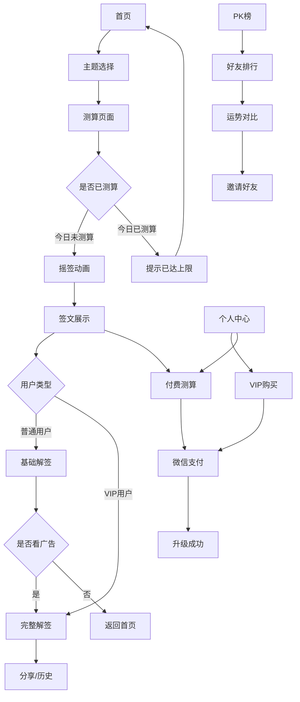

## 1. 产品概述
本产品是一款基于微信小程序的测算应用，提供传统测算体验的同时融入现代化功能。用户可通过预设主题图标进行测算，享受每日一次免费测算服务，并通过VIP会员和付费测算获得更多功能和深度解读。

产品主要解决用户寻求心灵慰藉、运势指导的需求，通过微信小程序便捷触达用户，结合广告变现和会员服务实现商业价值。

## 2. 核心功能

### 2.1 用户角色
| 角色 | 注册方式 | 核心权限 |
|------|----------|----------|
| 普通用户 | 微信授权登录 | 每日免费测算1次，看广告解锁完整解签 |
| VIP用户 | 付费升级 | 每日测算3次，无广告，专属壁纸头像框，全年运势总结 |

### 2.2 功能模块
本测算应用包含以下核心页面：
1. **首页**：主题选择、测算入口、运势展示
2. **测算页面**：摇签动画、签文展示、解签详情
3. **个人中心**：用户信息、VIP状态、历史签文
4. **PK榜页面**：好友排行榜、运势对比
5. **支付页面**：VIP购买、付费测算购买

### 2.3 页面详情
| 页面名称 | 模块名称 | 功能描述 |
|----------|----------|----------|
| 首页 | 主题选择区 | 展示预设主题图标，用户可选择测算主题（财运、事业、爱情等） |
| 首页 | 测算入口 | 摇签按钮，触发测算动画和流程 |
| 首页 | 今日运势 | 展示当日运势概览和推荐信息 |
| 测算页面 | 摇签动画 | 模拟真实摇签体验，3D动画效果 |
| 测算页面 | 签文展示 | 显示求得的签文内容和基本解读 |
| 测算页面 | 完整解签 | 深度解读内容，普通用户需看广告解锁 |
| 测算页面 | 付费引导 | 展示深度财运签、生意开运签、年度总运入口，引导用户付费获取更深度的解读 |
| 测算页面 | 分享功能 | 生成分享卡片，可分享到微信好友或朋友圈 |
| 个人中心 | 用户信息 | 显示头像、昵称、VIP状态、剩余测算次数 |
| 个人中心 | VIP专区 | VIP购买入口、会员权益说明、专属内容 |
| 个人中心 | 历史签文 | 历史测算记录，支持按时间筛选 |
| 个人中心 | 设置选项 | 通知设置、隐私设置、客服联系 |
| PK榜页面 | 好友排行 | 显示微信好友的运势排行榜 |
| PK榜页面 | 运势对比 | 与好友运势对比分析 |
| PK榜页面 | 邀请功能 | 邀请好友参与PK，增加互动性 |
| 支付页面 | VIP购买 | 月度/年度VIP会员购买选项 |
| 支付页面 | 付费测算 | 深度财运签3元、生意开运签5元、年度总运12元 |

## 3. 核心流程

### 普通用户流程
用户进入小程序 → 选择测算主题 → 进行摇签 → 查看基础签文 → 选择是否观看广告解锁完整解签 → 可分享结果或查看历史记录

### VIP用户流程
用户进入小程序 → 选择测算主题 → 进行摇签 → 直接查看完整解签 → 可使用专属壁纸和头像框 → 查看全年运势总结 → 可分享结果或查看历史记录

### 付费测算流程
用户选择付费测算类型 → 确认支付金额 → 完成微信支付 → 进行专属测算流程 → 获得深度解读报告

## 4. 用户界面设计

### 4.1 设计风格
- **主色调**：中国红（#DC143C）配金色（#FFD700）点缀
- **辅助色**：深褐色（#8B4513）和米白色（#FAF0E6）
- **按钮样式**：圆角矩形，带有传统纹样边框
- **字体**：思源黑体，标题18-20px，正文14-16px
- **布局风格**：卡片式布局，顶部导航栏，底部标签栏
- **图标风格**：扁平化国风图标，融入传统元素如祥云、回纹等

### 4.2 页面设计概述
| 页面名称 | 模块名称 | UI元素 |
|----------|----------|--------|
| 首页 | 主题选择区 | 横向滑动卡片，每张卡片展示主题图标和名称，选中状态有金色边框 |
| 首页 | 测算入口 | 中央大号摇签筒图标，点击后有震动反馈和音效 |
| 首页 | 今日运势 | 半透明卡片展示，包含运势星级和简短描述 |
| 测算页面 | 摇签动画 | 全屏3D摇签筒，支持重力感应，掉落签支动画 |
| 测算页面 | 签文展示 | 仿古卷轴样式，竖排文字，金色边框装饰 |
| 测算页面 | 付费推荐区 | 底部或弹窗展示精美的付费签入口卡片（财运/生意/年运），配以吸引人的文案和价格标签 |
| 个人中心 | 用户信息 | 顶部背景为渐变红色，头像圆形带金色边框，VIP标识醒目 |
| 个人中心 | VIP专区 | 金色渐变按钮，皇冠图标，突出尊贵感 |
| PK榜页面 | 好友排行 | 列表式布局，前三名特殊标识，显示运势分数和头像 |

### 4.3 响应式设计
采用微信小程序原生适配方案，确保在不同尺寸手机上都有良好体验。主要考虑：
- iPhone和主流Android手机的屏幕适配
- 触摸交互优化，按钮点击区域不小于44px
- 横竖屏适配，核心功能在竖屏下完整展示

### 4.4 广告接入规范
- **开屏广告**：应用启动时展示，5秒后可跳过
- **激励视频广告**：用户主动触发观看，解锁完整解签
- **Banner广告**：非VIP用户在非核心操作区域展示
- **原生广告**：融入内容流中，标识清晰可辨