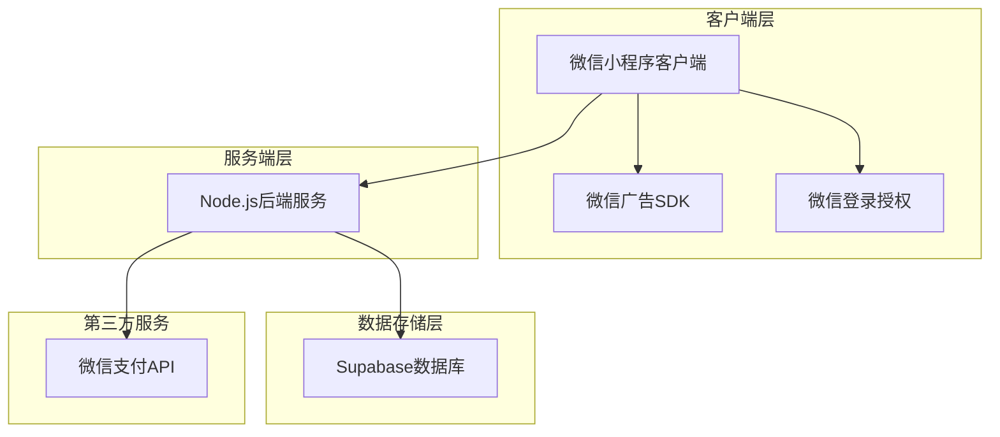
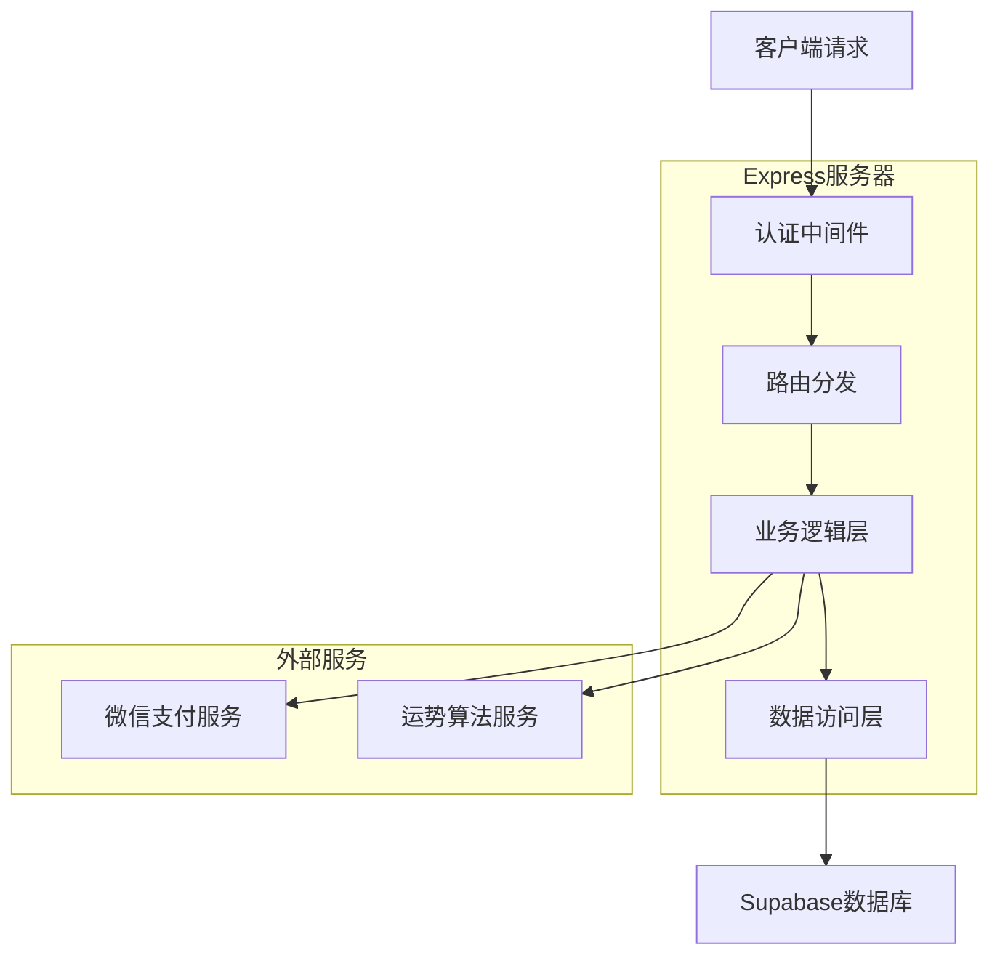
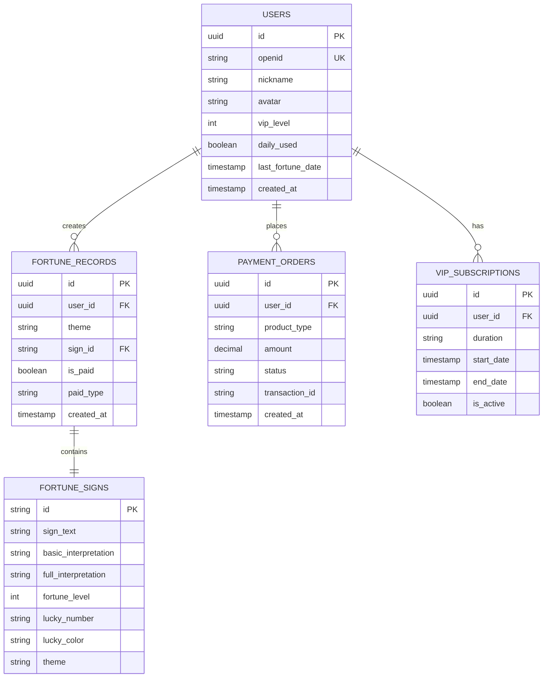

## 1. 架构设计



## 2. 技术描述

* **前端**: 微信小程序原生开发 + WXML/WXSS

* **后端**: Node.js\@18 + Express\@4

* **数据库**: Supabase (PostgreSQL)

* **初始化工具**: 微信小程序开发者工具

* **支付**: 微信支付APIv3

* **广告**: 微信广告组件

## 3. 路由定义

| 路由                        | 用途      |
| ------------------------- | ------- |
| /api/auth/login           | 微信登录授权  |
| /api/fortune/daily        | 每日测算接口  |
| /api/fortune/paid         | 付费测算接口  |
| /api/user/profile         | 获取用户信息  |
| /api/user/vip-status      | 获取VIP状态 |
| /api/payment/create-order | 创建支付订单  |
| /api/payment/verify       | 验证支付结果  |
| /api/ranking/friends      | 好友排行榜   |
| /api/admin/config         | 获取系统配置  |

## 4. API定义

### 4.1 用户认证相关

**微信登录**

```
POST /api/auth/login
```

请求参数：

| 参数名           | 参数类型   | 是否必需 | 描述       |
| ------------- | ------ | ---- | -------- |
| code          | string | 是    | 微信登录code |
| encryptedData | string | 是    | 加密用户数据   |
| iv            | string | 是    | 加密向量     |

响应：

```json
{
  "status": "success",
  "data": {
    "token": "jwt_token_string",
    "userInfo": {
      "id": "user_id",
      "nickname": "用户昵称",
      "avatar": "头像URL",
      "vipLevel": 0,
      "dailyFortuneUsed": false,
      "fortuneCount": 0
    }
  }
}
```

### 4.2 测算相关

**每日测算**

```
POST /api/fortune/daily
```

请求头：

```
Authorization: Bearer jwt_token
```

请求参数：

| 参数名   | 参数类型   | 是否必需 | 描述             |
| ----- | ------ | ---- | -------------- |
| theme | string | 是    | 测算主题（财运/事业/爱情） |

响应：

```json
{
  "status": "success",
  "data": {
    "fortuneId": "fortune_id",
    "signText": "签文内容",
    "basicInterpretation": "基础解读",
    "fullInterpretation": "完整解读（VIP直接展示）",
    "luckyNumber": 8,
    "luckyColor": "红色",
    "fortuneLevel": 4,
    "shareImage": "分享图片URL",
    "recommendPaidFortune": {
      "show": true,
      "type": "yearly_fortune",
      "title": "查看您的年度运势",
      "price": 12.00
    }
  }
}
```

**付费测算**

```
POST /api/fortune/paid
```

请求参数：

| 参数名     | 参数类型   | 是否必需 | 描述                                 |
| ------- | ------ | ---- | ---------------------------------- |
| type    | string | 是    | 付费类型（deep\_wealth/business/yearly） |
| orderId | string | 是    | 支付订单ID                             |

响应：

```json
{
  "status": "success",
  "data": {
    "fortuneId": "fortune_id",
    "signText": "专属签文",
    "detailedReport": "详细运势报告",
    "suggestions": "具体建议",
    "validUntil": "2024-12-31"
  }
}
```

### 4.3 支付相关

**创建支付订单**

```
POST /api/payment/create-order
```

请求参数：

| 参数名         | 参数类型   | 是否必需 | 描述                                     |
| ----------- | ------ | ---- | -------------------------------------- |
| productType | string | 是    | 产品类型（vip/deep\_wealth/business/yearly） |
| duration    | string | 否    | VIP时长（month/year）                      |

响应：

```json
{
  "status": "success",
  "data": {
    "orderId": "order_id",
    "paymentParams": {
      "timeStamp": "1640995200",
      "nonceStr": "random_string",
      "package": "prepay_id=xxx",
      "signType": "RSA",
      "paySign": "signature"
    }
  }
}
```

## 5. 服务器架构设计



## 6. 数据模型

### 6.1 数据模型定义



### 6.2 数据定义语言

**用户表 (users)**

```sql
-- 创建用户表
CREATE TABLE users (
    id UUID PRIMARY KEY DEFAULT gen_random_uuid(),
    openid VARCHAR(100) UNIQUE NOT NULL,
    nickname VARCHAR(100),
    avatar TEXT,
    vip_level INTEGER DEFAULT 0,
    daily_used BOOLEAN DEFAULT FALSE,
    last_fortune_date DATE,
    fortune_count INTEGER DEFAULT 0,
    created_at TIMESTAMP WITH TIME ZONE DEFAULT NOW(),
    updated_at TIMESTAMP WITH TIME ZONE DEFAULT NOW()
);

-- 创建索引
CREATE INDEX idx_users_openid ON users(openid);
CREATE INDEX idx_users_vip_level ON users(vip_level);
```

**签文表 (fortune\_signs)**

```sql
-- 创建签文表
CREATE TABLE fortune_signs (
    id VARCHAR(20) PRIMARY KEY,
    sign_text TEXT NOT NULL,
    basic_interpretation TEXT NOT NULL,
    full_interpretation TEXT NOT NULL,
    fortune_level INTEGER CHECK (fortune_level BETWEEN 1 AND 5),
    lucky_number VARCHAR(10),
    lucky_color VARCHAR(20),
    theme VARCHAR(20) CHECK (theme IN ('wealth', 'career', 'love')),
    created_at TIMESTAMP WITH TIME ZONE DEFAULT NOW()
);

-- 初始化签文数据
INSERT INTO fortune_signs (id, sign_text, basic_interpretation, full_interpretation, fortune_level, lucky_number, lucky_color, theme) VALUES
('wealth_001', '财运亨通，正财偏财皆旺', '近期财运不错，可适当投资', '您的财运正处于上升期，不仅正财运稳定，偏财运也有所提升。建议把握好投资机会，但要量力而行，不可贪心。', 5, '8', '金色', 'wealth'),
('wealth_002', '财运平稳，守成为上', '财运一般，宜守不宜攻', '当前财运相对平稳，没有大的起伏。建议以守成为主，不宜进行高风险投资。积蓄力量等待更好时机。', 3, '5', '黄色', 'wealth'),
('career_001', '事业腾飞，贵人相助', '事业发展顺利，有贵人扶持', '您的事业运势极佳，不仅工作顺利，还有贵人相助。是提升职位或转换跑道的好时机，要勇于把握机会。', 5, '9', '紫色', 'career'),
('love_001', '桃花朵朵，情缘将至', '感情运势上升，有望遇到良缘', '您的感情运势正处于高峰期，单身者有望遇到心仪对象，已有伴侣者感情会更加甜蜜。建议多参加社交活动。', 5, '2', '粉色', 'love');
```

**测算记录表 (fortune\_records)**

```sql
-- 创建测算记录表
CREATE TABLE fortune_records (
    id UUID PRIMARY KEY DEFAULT gen_random_uuid(),
    user_id UUID REFERENCES users(id),
    theme VARCHAR(20) CHECK (theme IN ('wealth', 'career', 'love')),
    sign_id VARCHAR(20) REFERENCES fortune_signs(id),
    is_paid BOOLEAN DEFAULT FALSE,
    paid_type VARCHAR(20),
    created_at TIMESTAMP WITH TIME ZONE DEFAULT NOW()
);

-- 创建索引
CREATE INDEX idx_fortune_records_user_id ON fortune_records(user_id);
CREATE INDEX idx_fortune_records_created_at ON fortune_records(created_at DESC);
```

**支付订单表 (payment\_orders)**

```sql
-- 创建支付订单表
CREATE TABLE payment_orders (
    id UUID PRIMARY KEY DEFAULT gen_random_uuid(),
    user_id UUID REFERENCES users(id),
    product_type VARCHAR(20) NOT NULL,
    amount DECIMAL(10,2) NOT NULL,
    status VARCHAR(20) DEFAULT 'pending',
    transaction_id VARCHAR(100),
    created_at TIMESTAMP WITH TIME ZONE DEFAULT NOW(),
    updated_at TIMESTAMP WITH TIME ZONE DEFAULT NOW()
);

-- 创建索引
CREATE INDEX idx_payment_orders_user_id ON payment_orders(user_id);
CREATE INDEX idx_payment_orders_status ON payment_orders(status);
```

**VIP订阅表 (vip\_subscriptions)**

```sql
-- 创建VIP订阅表
CREATE TABLE vip_subscriptions (
    id UUID PRIMARY KEY DEFAULT gen_random_uuid(),
    user_id UUID REFERENCES users(id),
    duration VARCHAR(10) CHECK (duration IN ('month', 'year')),
    start_date DATE NOT NULL,
    end_date DATE NOT NULL,
    is_active BOOLEAN DEFAULT TRUE,
    created_at TIMESTAMP WITH TIME ZONE DEFAULT NOW()
);

-- 创建索引
CREATE INDEX idx_vip_subscriptions_user_id ON vip_subscriptions(user_id);
CREATE INDEX idx_vip_subscriptions_active ON vip_subscriptions(is_active);
```

## 7. 核心算法设计

### 7.1 测算算法

```javascript
// 测算算法伪代码
function getFortuneSign(userId, theme, isVip) {
    // 1. 检查用户今日是否已测算
    if (!isVip && hasDailyFortuneUsed(userId)) {
        return { error: "今日测算次数已用完" };
    }
    
    // 2. 根据主题获取对应签文池
    const signPool = getSignsByTheme(theme);
    
    // 3. 基于用户历史记录和随机因子选择签文
    const weights = calculateWeights(userId, signPool);
    const selectedSign = weightedRandomSelect(signPool, weights);
    
    // 4. 记录历史签文
    recordFortune(userId, selectedSign.id, theme);
    
    // 5. 返回签文内容
    return formatFortuneResult(selectedSign, isVip);
}
```

### 7.2 运势评分算法

```javascript
// 评分算法
function calculateFortuneScore(userId) {
    const recentFortunes = getRecentFortunes(userId, 30);
    let totalScore = 0;
    
    // 基于近期测算结果计算
    recentFortunes.forEach(fortune => {
        totalScore += fortune.level * getTimeDecay(fortune.date);
    });
    
    return Math.round(totalScore / recentFortunes.length);
}
```

## 8. 安全配置

### 8.1 数据库访问权限

```sql
-- 匿名用户权限
GRANT SELECT ON fortune_signs TO anon;
GRANT SELECT ON public schema TO anon;

-- 认证用户权限
GRANT ALL PRIVILEGES ON users TO authenticated;
GRANT ALL PRIVILEGES ON fortune_records TO authenticated;
GRANT ALL PRIVILEGES ON payment_orders TO authenticated;
GRANT ALL PRIVILEGES ON vip_subscriptions TO authenticated;
```

### 8.2 行级安全策略

```sql
-- 用户只能查看和修改自己的数据
ALTER TABLE users ENABLE ROW LEVEL SECURITY;
CREATE POLICY user_policy ON users FOR ALL USING (auth.uid() = id);

ALTER TABLE fortune_records ENABLE ROW LEVEL SECURITY;
CREATE POLICY fortune_policy ON fortune_records FOR ALL USING (auth.uid() = user_id);
```

